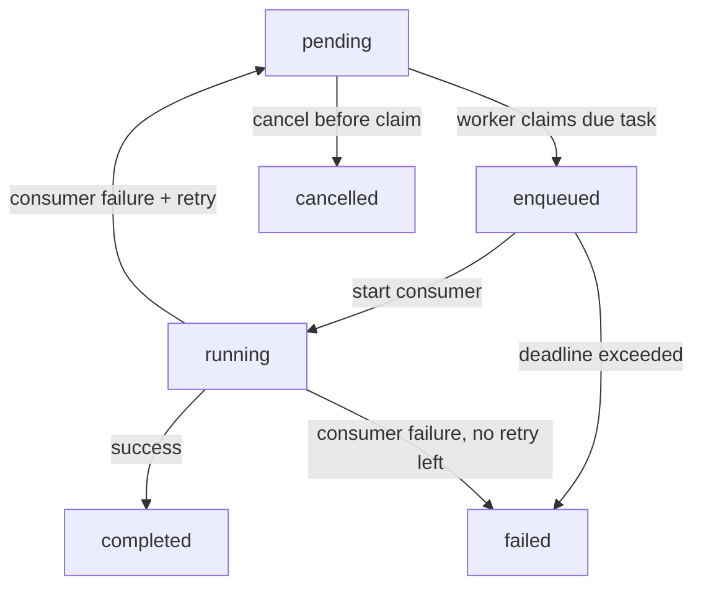
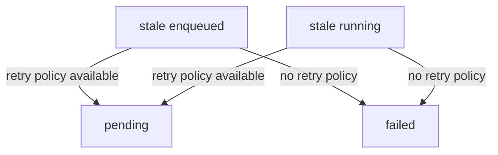
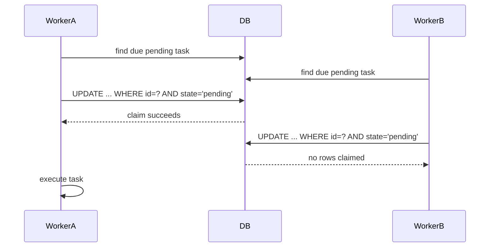

# gasket

> A reliable Go task scheduler and consumer with no service dependencies.

> **Important**
> 
> `gasket` is an embedded scheduler. Tasks, schedules, retries, and results are stored in SQLite through `gomysql`, so there is no Redis, broker, or sidecar service to operate.

## Highlights

- Atomic multi-client task claiming
- Immediate tasks, delayed tasks, and deadline-based tasks
- Retry policies with persisted retry counts
- Durable task result storage
- Pending-task cancellation
- Optional recovery for stale `enqueued` or `running` tasks
- Configurable poll interval and SQLite lock retry behavior

## Status

- [x] Task creation and persistence
- [x] Consumer registration
- [x] Scheduler run loop
- [x] Atomic claim across multiple clients
- [x] Retry scheduling
- [x] Deadline failure for overdue `RunBy` tasks
- [x] `WaitForEnqueue`
- [x] `WaitForCompletion`
- [x] Pending-task cancellation
- [x] Durable result data
- [x] Optional interrupted-task recovery
- [ ] Heartbeat / lease extension for long-running tasks
- [ ] Cancellation for claimed or running tasks

## Quick Start

Please see the example in `example/main.go` for a runnable demonstration of the public API.

## Scheduling Model

| API | Meaning |
| --- | --- |
| `NewTask("type", payload)` | Queue a task immediately |
| `ScheduleIn(duration)` | Delay execution until `time.Now().Add(duration)` with normal priority |
| `RunIn(duration)` | Delay execution until `time.Now().Add(duration)` and prefer it ahead of normal scheduled tasks once it is due |
| `RunBy(duration)` | Make the task runnable immediately, but fail it if it has not started before `time.Now().Add(duration)` |
| `RetryPolicy(maxRetries, retryDelay)` | Retry failed or interrupted tasks |

### Execution Lifecycle



### Recovery Paths



### Claim Flow



## Public API

### Client

```go
client, err := gasket.NewClient("tasks.db", opts...)
```

Available client options:

| Option | Purpose |
| --- | --- |
| `gasket.PollInterval(d)` | Scheduler loop interval |
| `gasket.DatabaseLockRetry(count, delay)` | SQLite busy retry behavior |
| `gasket.TaskRecoveryTimeout(d)` | Recover stale `enqueued` or `running` tasks after `d` |

### Task control

| Method | Behavior |
| --- | --- |
| `WaitForEnqueue()` | Blocks until a task is claimed or finishes/cancels first |
| `WaitForCompletion()` | Blocks until terminal state and returns persisted result |
| `Cancel()` | Cancels only `pending` tasks |

> **Note**
> Cancelling claimed or running tasks is intentionally not supported.

## Recovery Behavior

Interrupted-task recovery is opt-in through `TaskRecoveryTimeout`.

When enabled, the scheduler scans for tasks that have been stuck longer than the configured timeout:

- `enqueued` tasks older than `EnqueuedAt + timeout`
- `running` tasks older than `StartedAt + timeout`

Recovered tasks behave like normal failures:

- If a retry policy is available, the task goes back to `pending`
- Otherwise, the task is marked `failed`

> **Warning**
> Recovery is timeout-based, not heartbeat-based. If your consumer can legitimately run longer than the configured timeout, do not enable recovery with a shorter value.

## Result Semantics

`TaskConsumerResult` is persisted when a task reaches a terminal state:

```go
type TaskConsumerResult struct {
    Success bool
    Error   error
    Data    []byte
}
```

- `Success=true` and `Error=nil` marks the task `completed`
- `Success=false` or `Error!=nil` marks the task `failed`
- `Data` is stored and returned by `WaitForCompletion()`

## Examples

### Immediate task

```go
taskInfo := client.MustNewTask("email", []byte("Send now"))
```

### Delayed task

```go
taskInfo := client.MustNewTask(
	"email",
	[]byte("Send later"),
	gasket.ScheduleIn(15*time.Minute),
)
```

### Imperative delayed task

```go
taskInfo := client.MustNewTask(
	"email",
	[]byte("Send later, but before normal delayed work"),
	gasket.RunIn(15*time.Minute),
)
```

### Deadline task

```go
taskInfo := client.MustNewTask(
	"email",
	[]byte("Must run before the window closes"),
	gasket.RunBy(30*time.Second),
)
```

### Retried task

```go
taskInfo := client.MustNewTask(
	"email",
	[]byte("Retry if needed"),
	gasket.RetryPolicy(3, 10*time.Second),
)
```

### Cancel a pending task

```go
if err := taskInfo.Cancel(); err != nil {
	panic(err)
}
```

## Operational Notes

<details>
<summary><strong>Why SQLite lock retries exist</strong></summary>

Multiple clients can point at the same database file. SQLite may briefly return `SQLITE_BUSY` under write contention, so `gasket` retries the affected read or write operation using the configured lock retry policy.
</details>

<details>
<summary><strong>What a retry means</strong></summary>

Retries are only consumed after a task has actually failed or has been recovered as interrupted. A deadline failure from an overdue `RunBy` task does not consume retries.
</details>

<details>
<summary><strong>When to use ScheduleIn vs RunIn vs RunBy</strong></summary>

Use `ScheduleIn` for normal delayed work.

Use `RunIn` for delayed work that should still outrank normal scheduled tasks after it becomes due.

Use `RunBy` when the task should start as soon as a worker can take it, but the start time still has a hard cutoff.
</details>

<details>
<summary><strong>What is currently out of scope</strong></summary>

- Forced cancellation of already claimed or running tasks
- Heartbeats for long-running workers
- Distributed worker identity or leases
</details>

## Development

Run the test suite with:

```bash
go test ./...
```

Run processing benchmarks with:

```bash
go test ./tests -run '^$' -bench BenchmarkTaskProcessing -count=1 -benchmem
```

To write PNG benchmark plots with error bars:

```bash
GASKET_BENCH_PLOT_DIR=benchmarks GASKET_BENCH_JSON=benchmarks/results.jsonl go test ./tests -run '^$' -bench BenchmarkTaskProcessing -benchtime=1000x -count=5 -benchmem
```

The benchmark matrix covers small immediate tasks, due scheduled tasks, mixed success/failure/retry tasks, retry-once tasks, and large payload tasks across 1, 2, and 4 clients.

This writes `ops-by-client.png`, `p95-latency-by-client.png`, `payload-throughput-by-client.png`, `outcomes.png`, and one `ops-over-time-*.png` file per workload. Use `-count` greater than one to make the error bars meaningful.

Set `GASKET_BENCH_JSON` to also append raw JSONL data, and set `GASKET_BENCH_SAMPLE_INTERVAL`, for example `50ms`, to change the time-series sample interval.
